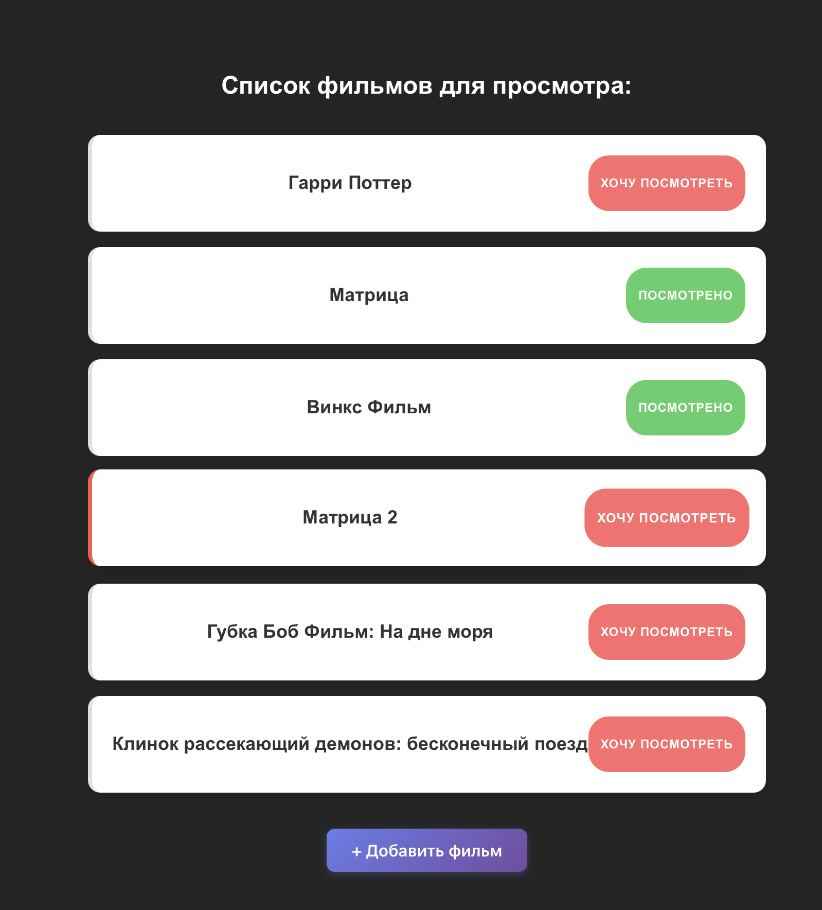
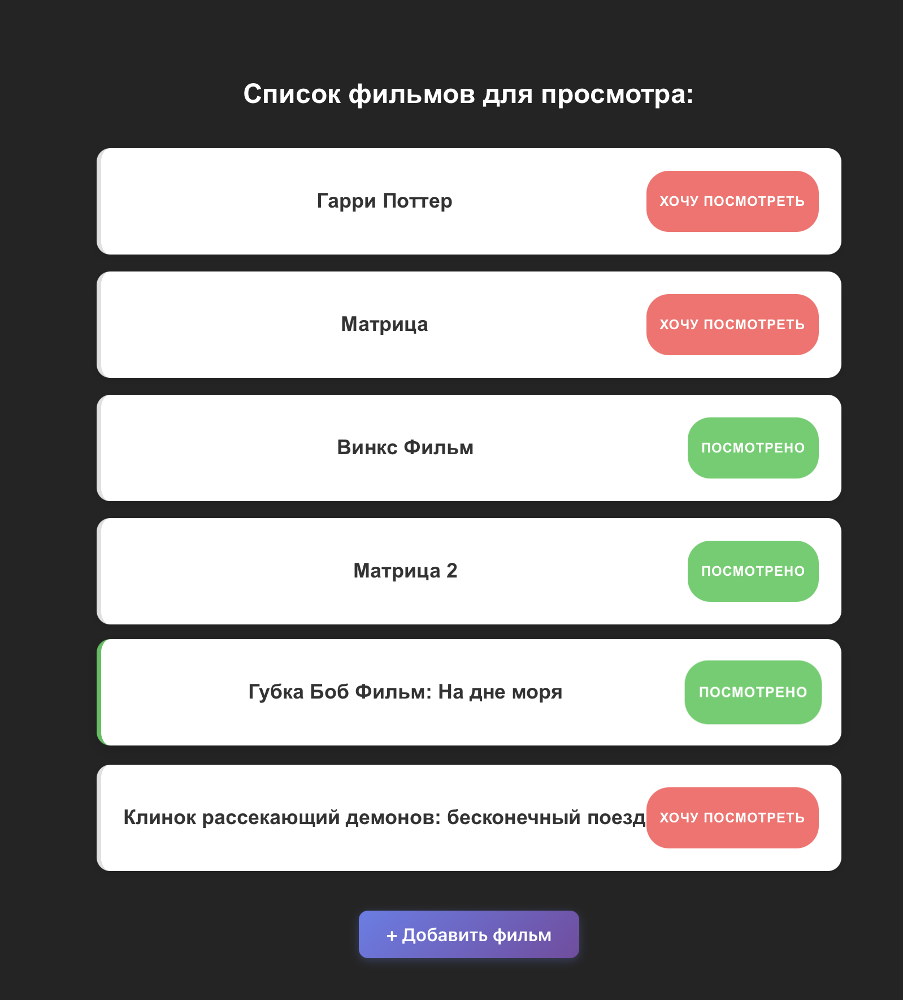
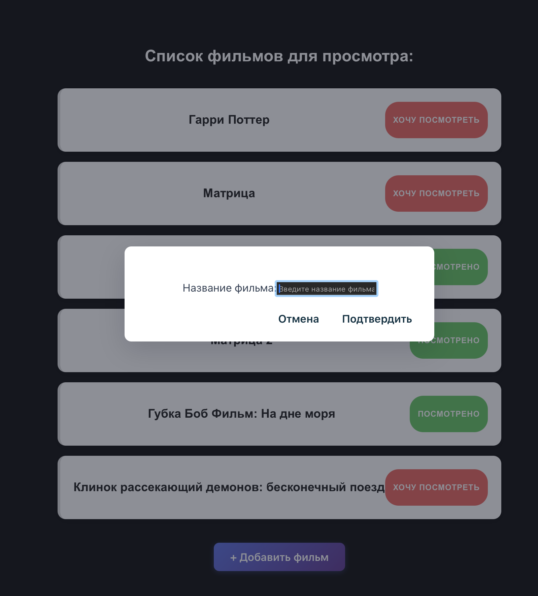

# Список фильмов для просмотра

Проект для сдачи контрольной работы 4 по курсу Технологии Индустриального Программирования

## Запуск (локально)

```bash
npm run dev
```

## Функционал

- Изменение состояний фильма (хочу посмотреть/посмотрено)

- Добавление новых фильмов (не доработан последний этап)

## Особенности реализации

Изменяющиеся параметры должны вызывать перерендер страницы поэтому используются useState

Также для удобства были выделены в отдельный компоненты Button и ConfirmModal. Это позволяет грамотно разделять обязаности каждого куска кода


## Интерфейс






